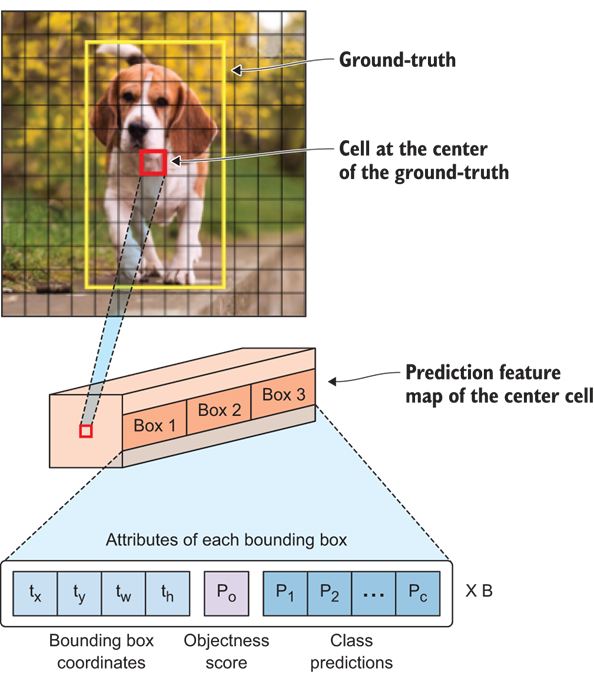

# Deep Learning Live Feed Object Detection

This project uses a Convolutional Neural Network (CNN) to automatically detect and track objects in real-time video feeds. The images used for training are annotated in yolov3 format with labelimg. DarkNet is used to train the model on GPU's and the output is collected to perform an analysis on the loss function. The OpenCV library is used to capture live stream video. Each frame is captured, processed with the model, integrated with an object detection bounding box, and displayed to the end user in real-time. 

The CNN splits the input image into a grid of S×S cells. If the center of the ground truth box falls into a cell, that cell is responsible for detecting the existence of that object. Each grid cell predicts B number of bounding boxes and their objectness score along with their class predictions as follows:

* Coordinates of B bounding boxes - similar to previous detectors, the CNN predicts 4 coordinates for each bounding box (bx,by,bw,bh). Where x and y are set to be offset of a cell location.
* Objectness score - indicates the probability that the cell contains an object. The objectness score is passed through a sigmoid function to be treated as a probability with a value range between 0 and 1. 
* Class prediction - if the bounding box contains an object, the network predicts the probability of K number of classes. Where K is the total number of classes in your problem.

A graphical representation of the workflow follows:


The live stream object detection results in this:


## Getting Started

These instructions will allow you to run your own live-stream object detection.

You can chose to [use the pre-trained model](#option-1-use-the-pre-trained-model)
or you can [train your own model](#option-2-train-a-custom-model)

### Prerequisites

* python3
* opencv-python
* matplotlib
* labelimg
* google_images_search
* sips

### Clone Repository

This codebase was developed and tested in PyCharm.

1. Donwload the [PyCharm IDE](https://www.jetbrains.com/pycharm/download/)

2. Clone this repository into the PyCharm IDE.
    ```
    https://github.com/nashebismaily/deep-learning-live-feed-object-detection.git
    ```

### Option 1: Use the Pre-Trained Model

Download my pre-trained model:

[Pre-Trained ML Model](https://srv-file6.gofile.io/download/Bfj367/yolov3.weights)

Place yolov3.weights into this folder:

```
deep-learning-live-feed-object-detection/model/config
```

### Option 2: Train a custom Model

1. Add your google api keys and update your image search in google.cfg:

    ```
    [image_download]
    search_string=car,truck,buss,motercycle,bicycle,dog,cat,fire hydrant,stop sign
    base_download_dir=/Downloads
    google_api_key=
    google_project_cx=
    ```

2. Download images

    ```
    deep-learning-live-feed-object-detection/images/DownloadImages.py
    ```

3. Pre-process images through resizing
    ```
    sips -Z 1024 *.jpg 

    sips  : the command and -Z keeps the image's aspect ratio
    1024  : the maximum width and height
    *.jpg : converts every image ending in .jpg
    ```

4. Use labelImg to annotate each image, ensure YOLO is set as the output type

    ```
    labelImg
    ```

    

5. Update the objects.names file to contain a list of objects that have been labeled

    ```
    deep-learning-live-feed-object-detection/model/config/objects.names 
    ```

6. Create a train.txt and test.txt file which contains abosolute path to images
    ```
    deep-learning-live-feed-object-detection/model/config/test.txt
    deep-learning-live-feed-object-detection/model/config/train.txt
    
    /root/photos/image1.jpg
    /root/photos/image2.jpg
    /root/photos/image3.jpg
    ...
    ```

7. Download and install darknet to help model training

    ```
    git clone https://github.com/pjreddie/darknet
    cd darknet
    make
    ```

8.  Configure darknet based directory

    ```
    deep-learning-live-feed-object-detection/config/darknet.cfg
    
    [darknet]
    darknet_base_dir=/root/darknet
    
    ```

9. Train the Model

    ```
    deep-learning-live-feed-object-detection/src/main/model/TrainModel.py
    ```
    
10. Training output can be viewed here

    ```
    deep-learning-live-feed-object-detection/model/logs
    ```

11. Once training is complete, observe the loss graph found here

    ```
    deep-learning-live-feed-object-detection/model/graphs
    ```

    

12. Select the appropriate weight that correlates to the elbow in the loss graph and move that here:

    ```
    deep-learning-live-feed-object-detection/model/weights/yolov3.weights
    ```

    
### Detect objects in static images

1. Add the path for the source and destination images into the config under the image section

    ```
    deep-learning-liveconf-feed-object-detection/config/detection.cfg

    input_image=/root/photos/input_photo.jpg
    output_image=/root/photos/output_photo.jpg
    ```

2. Run the static image object detection

    ```
    deep-learning-liveconf-feed-object-detection/src/main/detection/DetectImage.py
    ```

### Detect objects in video

1. Add the path for the source and destination videos into the config under the video section.

   Note: The output video needs to be in .avi format
   
    ```
    deep-learning-liveconf-feed-object-detection/config/detection.cfg

    input_video=/root/videos/input_video.mov
    output_video=/root/videos/output_video.avi
    ```

2. Run the video object detection

    ```
    deep-learning-liveconf-feed-object-detection/src/main/detection/DetectVideo.py
    ```

### Detect objects in camera


1. Scan your cameras to detect available camera id's

    ```
    deep-learning-liveconf-feed-object-detection/src/main/utils/ScanCameras.py

    [0]
    ```

2. Update detection.cfg with your selected device id

    ```
    deep-learning-liveconf-feed-object-detection/config/detection.cfg

    device_id=0
    ```

3. Run the live-stream  object detection

    ```
    deep-learning-liveconf-feed-object-detection/src/main/detection/DetectCamera.py
    ```

## Running the tests

Each module has its own set of unit test that can be run.

```
deep-learning-liveconf-feed-object-detection/test/main/detection/TestCaptureStream.py
deep-learning-liveconf-feed-object-detection/test/main/detection/TestDarkNet.py
```

## Built With

* [DarkNet](https://pjreddie.com/darknet/)
* [Yolov3](https://pjreddie.com/darknet/yolo/)
* [OpenCV2](https://pypi.org/project/opencv-python/)
* [Deep Learning](https://livebook.manning.com/book/grokking-deep-learning-for-computer-vision/chapter-7/v-8/1)

## Authors

* **Nasheb Ismaily** 

## License

This project is licensed under the MIT License - see the [LICENSE.md](LICENSE.md) file for details


